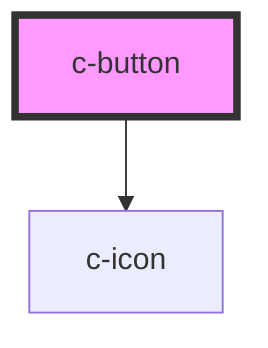

# c-button

<!-- Auto Generated Below -->

## Properties

| Property      | Attribute      | Description | Type      | Default     |
| ------------- | -------------- | ----------- | --------- | ----------- |
| `appendIcon`  | `append-icon`  |             | `string`  | `''`        |
| `classIcon`   | `class-icon`   |             | `string`  | `'h-4 w-4'` |
| `disabled`    | `disabled`     |             | `boolean` | `false`     |
| `prependIcon` | `prepend-icon` |             | `string`  | `''`        |
| `size`        | `size`         |             | `string`  | `'md'`      |
| `variant`     | `variant`      |             | `string`  | `'default'` |

## Dependencies

### Depends on

- [c-icon](../c-icon)

### Graph

----------------------------------------------

*Built with [StencilJS](https://stenciljs.com/)*
