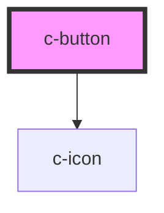

# c-button

<!-- Auto Generated Below -->

## Properties

| Property   | Attribute  | Description | Type      | Default     |
| ---------- | ---------- | ----------- | --------- | ----------- |
| `disabled` | `disabled` |             | `boolean` | `false`     |
| `size`     | `size`     |             | `string`  | `'default'` |
| `variant`  | `variant`  |             | `string`  | `'default'` |

## Dependencies

### Depends on

- [c-icon](../c-icon)

### Graph

----------------------------------------------

*Built with [StencilJS](https://stenciljs.com/)*
