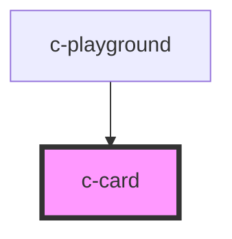

# c-card

<!-- Auto Generated Below -->

## Properties

| Property      | Attribute     | Description | Type     | Default     |
| ------------- | ------------- | ----------- | -------- | ----------- |
| `description` | `description` |             | `string` | `undefined` |
| `footer`      | `footer`      |             | `string` | `undefined` |
| `subtitle`    | `subtitle`    |             | `string` | `undefined` |
| `title`       | `title`       |             | `string` | `undefined` |

## Dependencies

### Used by

 - [c-playground](../c-playground)

### Graph

----------------------------------------------

*Built with [StencilJS](https://stenciljs.com/)*
