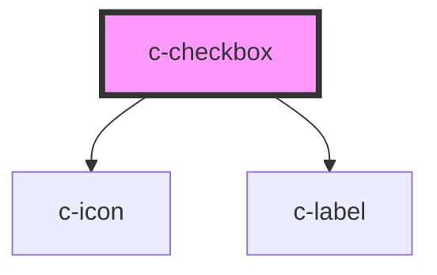

# c-checkbox

<!-- Auto Generated Below -->

## Properties

| Property      | Attribute     | Description | Type      | Default     |
| ------------- | ------------- | ----------- | --------- | ----------- |
| `checked`     | `checked`     |             | `boolean` | `false`     |
| `description` | `description` |             | `string`  | `undefined` |
| `disabled`    | `disabled`    |             | `boolean` | `false`     |

## Dependencies

### Depends on

- [c-icon](../c-icon)
- [c-label](../c-label)

### Graph

----------------------------------------------

*Built with [StencilJS](https://stenciljs.com/)*
