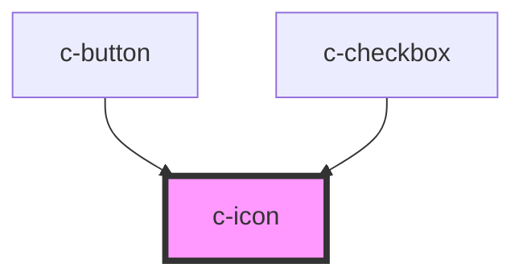

# c-icon

<!-- Auto Generated Below -->

## Properties

| Property      | Attribute      | Description | Type     | Default          |
| ------------- | -------------- | ----------- | -------- | ---------------- |
| `class`       | `class`        |             | `string` | `'h-4 w-4'`      |
| `color`       | `color`        |             | `string` | `'currentColor'` |
| `name`        | `name`         |             | `string` | `'circle'`       |
| `size`        | `size`         |             | `string` | `'24px'`         |
| `strokeWidth` | `stroke-width` |             | `string` | `'2px'`          |

## Dependencies

### Used by

 - [c-button](../c-button)
 - [c-checkbox](../c-checkbox)

### Graph

----------------------------------------------

*Built with [StencilJS](https://stenciljs.com/)*
