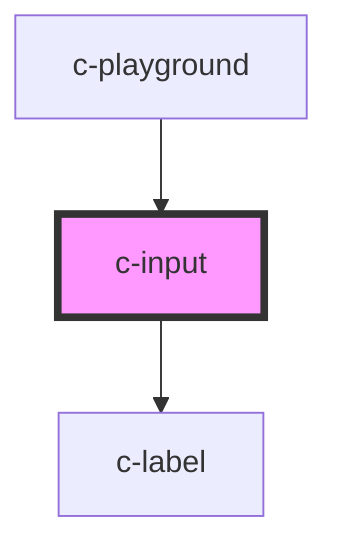

# c-input

<!-- Auto Generated Below -->

## Properties

| Property      | Attribute     | Description | Type      | Default         |
| ------------- | ------------- | ----------- | --------- | --------------- |
| `disabled`    | `disabled`    |             | `boolean` | `false`         |
| `label`       | `label`       |             | `string`  | `''`            |
| `max`         | `max`         |             | `string`  | `''`            |
| `min`         | `min`         |             | `string`  | `''`            |
| `placeholder` | `placeholder` |             | `string`  | `'Placeholder'` |
| `readonly`    | `readonly`    |             | `boolean` | `false`         |
| `required`    | `required`    |             | `boolean` | `false`         |
| `step`        | `step`        |             | `string`  | `''`            |
| `type`        | `type`        |             | `string`  | `'text'`        |
| `value`       | `value`       |             | `string`  | `''`            |

## Dependencies

### Used by

 - [c-playground](../c-playground)

### Depends on

- [c-label](../c-label)

### Graph

----------------------------------------------

*Built with [StencilJS](https://stenciljs.com/)*
