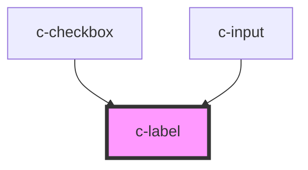

# c-label

<!-- Auto Generated Below -->

## Properties

| Property  | Attribute  | Description | Type     | Default   |
| --------- | ---------- | ----------- | -------- | --------- |
| `htmlFor` | `html-for` |             | `string` | `'input'` |

## Dependencies

### Used by

 - [c-checkbox](../c-checkbox)
 - [c-input](../c-input)

### Graph

----------------------------------------------

*Built with [StencilJS](https://stenciljs.com/)*
